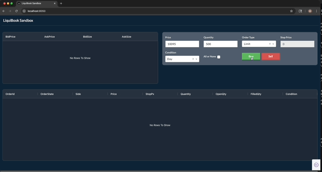

Setting up the environment
--------------------------
python -m venv venv_liquibook  
source venv_liquibook/bin/activate  

pip install -r requirements.txt  

Basic order book test
---------------------
python BasicOrderBookTest/basic_order_book_test.py  

LiquiBook Sandbox
-----------------
python LiquiBookSandbox/LiquiBookSandbox.py  

